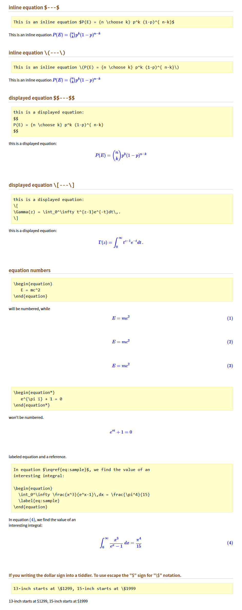

# MathJax plugin for TiddlyWiki Classic


## Description 


*   allows to use MathJax in TiddlyWiki Classic.
*   added inline equation $---$.
*   allows to use offline.
*   an equation numbers are reset by loading of a tiddler when using autoNumber. 


This plugin are adapted from `latex-for-tiddlywiki-a-mathjax-plugin` (on [LaTeX for TiddlyWiki – A MathJax Plugin - Guy Rutenberg](https://www.guyrutenberg.com/2011/06/25/latex-for-tiddlywiki-a-mathjax-plugin/) ).  
Thanks [Guy Rutenberg - MathJax Plugin](https://www.guyrutenberg.com/2011/06/25/latex-for-tiddlywiki-a-mathjax-plugin/).


Changes from the original
*   added inline equation.
*   added use offline.
*   added autoNumber.
*   added MathJax Configuration Options.


# Installation Plugin

Create a new tiddler with the following contents.

*   title:  
    => **PluginMathJax**
*   content:  
    => Copy the contents of **PluginMathJax.js** and paste it in the contents area.
*   tags:  
    => **systemConfig**

To enable the plugin, Save the TWC file and reload it.


# Usage

## inline equation `$---$`

```
This is an inline equation $P(E) = {n \choose k} p^k (1-p)^{ n-k}$ 
```

## inline equation `\(---\)`

```
This is an inline equation \(P(E) = {n \choose k} p^k (1-p)^{ n-k}\)
```
 
## displayed equation `$$---$$`

```
this is a displayed equation: 
$$
P(E) = {n \choose k} p^k (1-p)^{ n-k}
$$
```

## displayed equation `\[---\]`

```
this is a displayed equation: 
\[
\Gamma(z) = \int_0^\infty t^{z-1}e^{-t}dt\,.
\]
```

## equation numbers

will be numbered
```
\begin{equation}
   E = mc^2
\end{equation}
```

won’t be numbered.
```
\begin{equation*}
   e^{\pi i} + 1 = 0
\end{equation*}
```

labeled equation and a reference.
```
In equation $\eqref{eq:sample}$, we find the value of an
interesting integral:

\begin{equation}
  \int_0^\infty \frac{x^3}{e^x-1}\,dx = \frac{\pi^4}{15}
  \label{eq:sample}
\end{equation}
```


### If you writing the dollar sign into a tiddler. To use escape the "$" sign for "\$" notation.

```
13‑inch starts at \$1299, 15‑inch starts at \$1999
```


Displays as:



----


# Tips! 

## Offline use in the local library

When you want to use offline. Require to install "MathJax" on your PC.

## How to local installation

### setp1.

Download and install `MathJax` zip files. and then extract files using any extract tool. For example, [7-Zip](http://www.7-zip.org/), or [Lhaplus](http://www.forest.impress.co.jp/library/software/lhaplus/), etc.

Download MathJax from here
*   [mathjax.zip](http://docs.mathjax.org/en/latest/installation.html)

Extract "MathJax-2.x.zip" files. ("x" is any number of MathJax Current Version.)
Rename the directory name to "MathJax" from "MathJax-2.x".
Copy the "MathJax" directory to your TiddlyWiki directory.


These files must be installed in the same directory of the TiddlyWiki file.

like this
```
/TiddlyWiki/
    +--- memo.html           <== your TiddlyWiki file
    +--- MathJax/            <== MathJax directory is here
        config/
        docs/
        extensions/
        fonts/
        images/
        jax/
        localization/
        test/
        unpacked/
        MathJax.js
        *** etc. ***
```


### step2.

Edit the code to specify the local file directory.

*   Add comment mark "//" within an "online use" section.
*   Remove comment mark "//" within an "offline use" section.

Fix this part of the code.  
like this

```
// ## Offine use ##
mathJaxScript: "MathJax/MathJax.js?config=TeX-AMS_HTML",

// ## Online use ##
// ## uncomment the following line if you want to access MathJax using SSL ##
    mathJaxScript: "https://cdnjs.cloudflare.com/ajax/libs/mathjax/2.7.1/MathJax.js?config=TeX-AMS_HTML",
```


### step3.

To enable the plugin, Save the TWC file and reload it.


----


# License

BSD open source license
